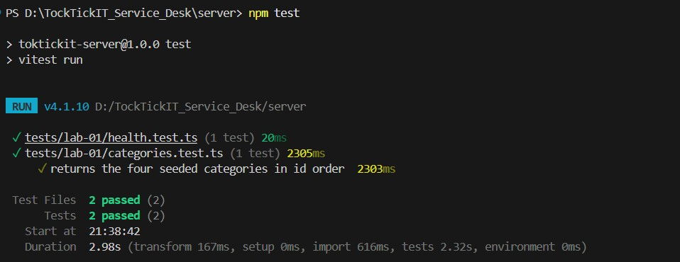
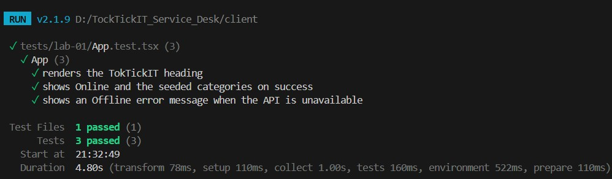
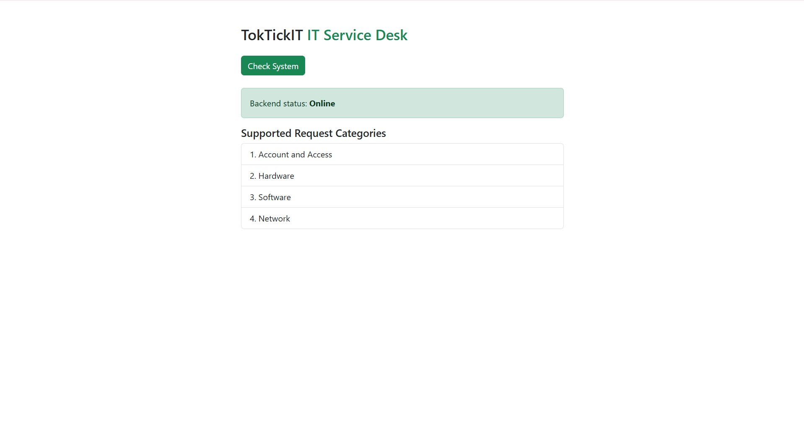
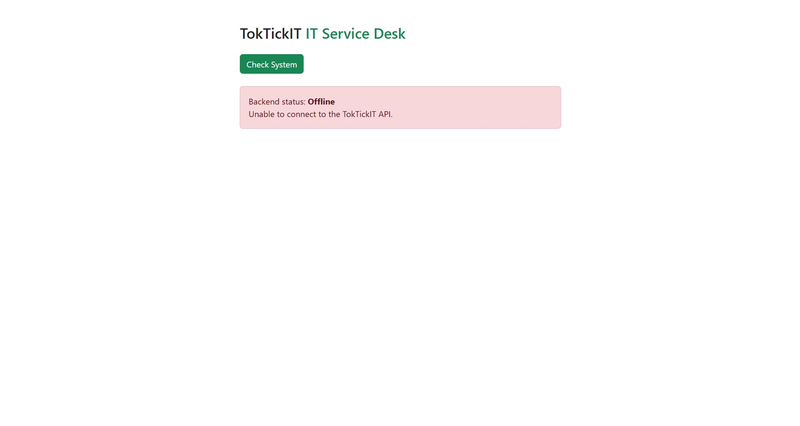

# Lab 1 — Test Plan and Evidence  (fill this in)

All test files live under server/tests/lab-01/ and client/tests/lab-01/.

| # | Tool | Test | Result |
|---|------|------|--------|
<<<<<<< Updated upstream
| API-1 | Supertest | GET /api/health returns 200, status=ok |passed|
| API-2 | Supertest | GET /api/categories returns 4 seeded categories in id order |passed|
| UI-1 | Vitest | Heading renders |passed|
| UI-2 | Vitest | Success state shows Online + category list |passed|
| UI-3 | Vitest | Error state shows Offline + message |passed|

Paste your passing terminal output / screenshot below.

API-1 & API-2

UI-1 

UI-2

UI-3
=======
| API 1 | Supertest | GET /api/health returns 200, status=ok |passed|
| API 2 | Supertest | GET /api/categories returns 4 seeded categories in id order |passed|
| UI 1 | Vitest | Heading renders |passed|
| UI 2 | Vitest | Success state shows Online + category list |passed|
| UI 3 | Vitest | Error state shows Offline + message |passed|

Paste your passing terminal output / screenshot below.

API 1 & API 2

UI 1
UI 1

UI 2

UI 3
>>>>>>> Stashed changes

